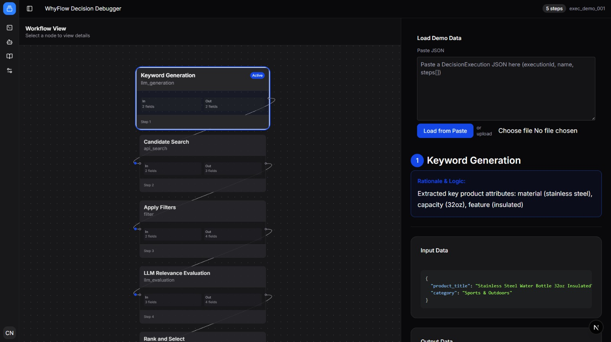

# WhyFlow

> A decision observability layer for systems where outcomes are produced through multiple rules, evaluations, or ranking steps.



## The 15-Minute Pitch: Why WhyFlow?

Imagine you're building a system that recommends products to users. A user sees a recommendation, and it's completely wrong. Why?

Did the initial data pull fail? Did a filter remove the correct items? Did the ranking algorithm deprioritize the best choice?

Traditional tools don't give you the full picture:
-   **Logs** tell you *what* happened, but the "why" is buried in a sea of text.
-   **Traces** show you which functions were called, but they don't explain the logic behind the decisions.
-   **Metrics** give you aggregated data, but they can't explain a single, specific outcome.

**WhyFlow is different.** It's a **decision observability system** that captures and visualizes the entire journey of a decision, from the initial input to the final outcome. It's not just for AI—it's for any system that makes decisions through a series of steps, whether they're rule-based, heuristic, or AI-driven.

With WhyFlow, you can finally answer the question: **"Why did the system make this decision?"**

## Core Concepts: The WhyFlow Mental Model

At the heart of WhyFlow are two simple concepts:

### 1. `DecisionExecution`

A `DecisionExecution` is a recording of a single, end-to-end decision-making process. Think of it as a flight recorder for your system's logic. It captures everything that happened during a specific transaction, from the moment a request comes in to the moment a decision is made.

Each `DecisionExecution` has:
-   A unique `executionId`
-   A descriptive `name` (e.g., "Product Recommendation Pipeline")
-   A `timestamp`
-   An ordered list of `DecisionSteps`

### 2. `DecisionStep`

A `DecisionStep` is a meaningful moment in the decision-making process. It's not just a function call—it's a point where a decision is made, data is transformed, or the set of possible outcomes is narrowed down.

Each `DecisionStep` can have:
-   An `input` and `output`
-   A `rationale` (a human-readable explanation of what happened)
-   `metadata` for any other relevant information

By combining these two concepts, you can create a complete, auditable record of every decision your system makes.

## High-Level Architecture

WhyFlow is a monorepo that contains everything you need to get started with decision observability:

```
/
├── apps/
│   ├── example/  # A demo dashboard that visualizes DecisionExecutions
│   └── docs/     # The documentation site
├── packages/
│   ├── core/     # The @whyflow/core SDK
│   └── ui/       # Shared UI components
```

-   **`@whyflow/core`**: The lightweight, framework-agnostic SDK that you'll use to instrument your code.
-   **`example`**: A Next.js application that provides a visual "decision debugger" for your `DecisionExecution` data.
-   **`docs`**: A Fumadocs site with detailed documentation and guides.
-   **`ui`**: A set of shared React components used by the `example` and `docs` applications.

## Quick Start: A Guided Tour

Let's walk through a simple example of how to use WhyFlow to instrument a competitor selection pipeline.

### 1. Install the SDK

```bash
pnpm add @whyflow/core
```

### 2. Create a `DecisionExecution`

First, create a new `DecisionExecution` to represent the entire process:

```typescript
import { Execution } from "@whyflow/core";

const execution = new Execution("Competitor Selection Pipeline");
```

### 3. Add `DecisionSteps`

Next, add a `DecisionStep` for each meaningful event in the process:

```typescript
execution.addStep({
  name: "Generate Search Keywords",
  input: {
    productTitle: "Stainless Steel Water Bottle 32oz",
  },
  output: {
    keywords: ["stainless steel water bottle", "insulated bottle"],
  },
  rationale: "Extracted key product attributes for search",
});

execution.addStep({
  name: "Apply Price Filter",
  input: { candidates: 50 },
  output: { qualified: 12, rejected: 38 },
  rationale: "Filtered products to $15-$60 range",
  metadata: {
    priceRange: { min: 15, max: 60 },
  },
});
```

### 4. Get the `DecisionExecution` Data

Finally, get the JSON representation of the `DecisionExecution`:

```typescript
const executionData = execution.toJSON();
```

You can now send this data to the WhyFlow decision debugger (the `example` app) to visualize the entire process.

## The Decision Debugger

The `example` application provides a powerful UI for visualizing and debugging your `DecisionExecutions`.

-   **Step Timeline**: A vertical timeline that shows each `DecisionStep` in the order it occurred.
-   **Input/Output Viewer**: A JSON viewer that lets you inspect the `input` and `output` of each `DecisionStep`.
-   **Rationale Display**: A prominent display for the `rationale` of each `DecisionStep`, so you can understand the "why" at a glance.

## Use Cases

WhyFlow is a general-purpose tool that can be used in a wide variety of scenarios:

-   **E-commerce**: Understand why a specific product was recommended to a user.
-   **Fintech**: Audit the steps of a loan application or fraud detection process.
-   **Adtech**: Debug the logic of an ad targeting or bidding system.
-   **Search**: Analyze the results of a search ranking algorithm.

## What WhyFlow Is Not

WhyFlow is **not**:

-   A tracing system (use Jaeger, Zipkin for that)
-   A logging framework (use Winston, Pino for that)
-   A metrics platform (use Prometheus, Datadog for that)
-   An AI framework
-   A rules engine

## Development

To get started with development, clone the repository and install the dependencies:

```bash
pnpm install
pnpm build
```

Run the example dashboard:

```bash
pnpm dev --filter example
```

Run the documentation site:

```bash
pnpm dev --filter docs
```